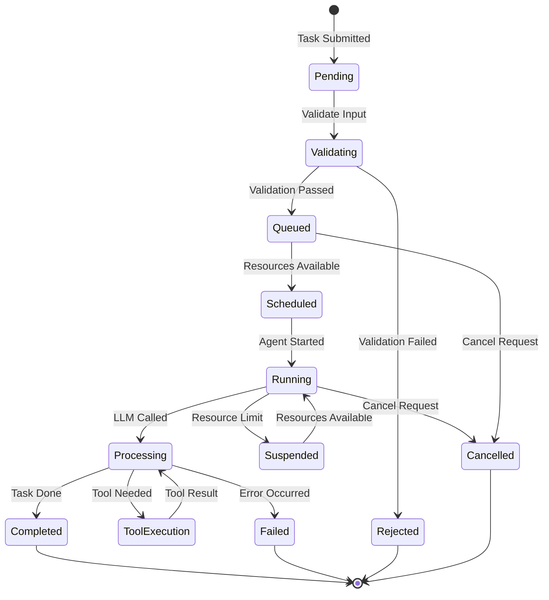
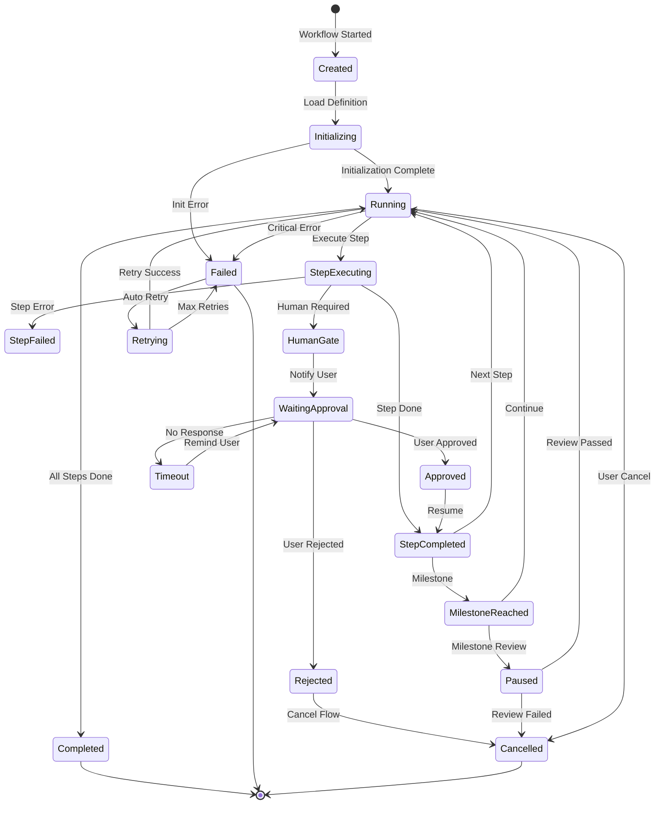
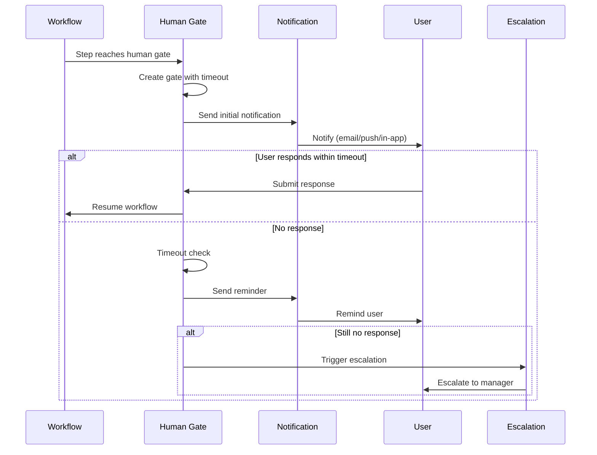
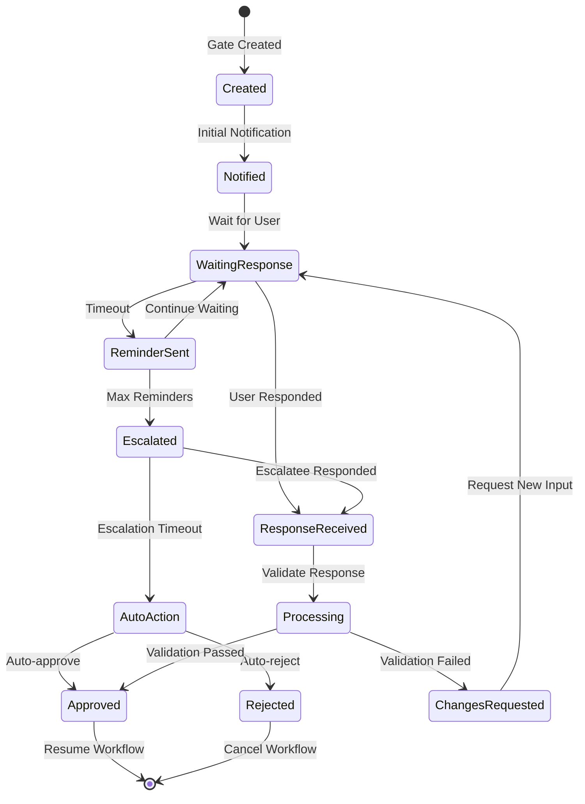
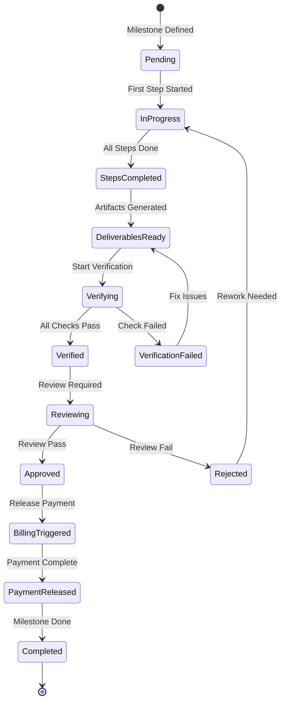
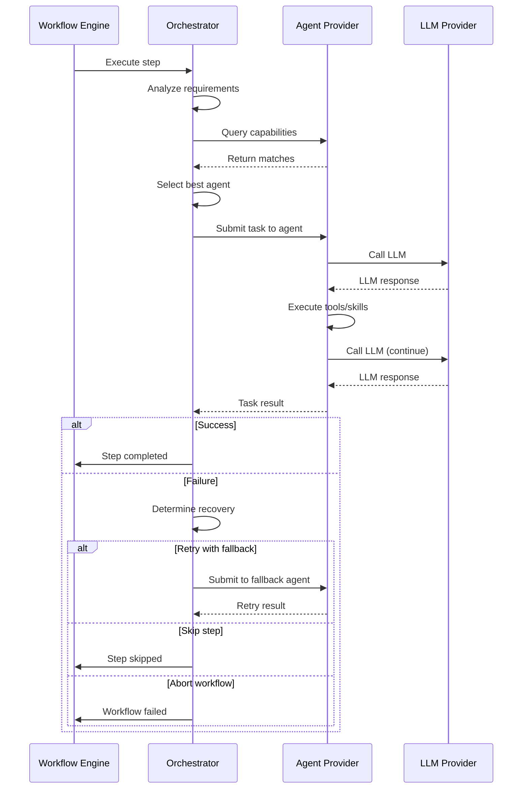

# Level 2/3 Provider Plugin Design - Complete Specification

> **Detailed design for Agent Provider (P03) and Workflow Provider (P04)**
> **Status:** Ready for development
> **Created:** 2026-03-02

---

## Table of Contents

1. [Agent Provider (P03) - Complete Design](#p03-agent-provider)
2. [Workflow Provider (P04) - Complete Design](#p04-workflow-provider)
3. [Provider Registration & Health Check](#provider-infrastructure)
4. [Billing & Settlement](#billing-settlement)
5. [Monitoring & Logging](#monitoring-logging)

---

## P03: Agent Provider (OpenFang)

### 1. Agent Task Execution State Machine



**State Definitions:**

```typescript
// plugins/agent-provider/src/task-executor/state-machine.ts

export enum TaskState {
  PENDING = 'pending',           // Task submitted, not yet processed
  VALIDATING = 'validating',     // Input validation in progress
  QUEUED = 'queued',             // Queued for execution
  SCHEDULED = 'scheduled',       // Scheduled with resources
  RUNNING = 'running',           // Agent executing
  PROCESSING = 'processing',     // LLM processing
  TOOL_EXECUTION = 'tool_execution', // External tool running
  SUSPENDED = 'suspended',       // Paused due to resource limits
  COMPLETED = 'completed',       // Successfully finished
  FAILED = 'failed',             // Execution failed
  REJECTED = 'rejected',         // Validation failed
  CANCELLED = 'cancelled'        // User cancelled
}

export interface TaskStateMachine {
  currentState: TaskState
  taskId: string
  transitions: StateTransition[]
  metadata: TaskMetadata
}

export interface StateTransition {
  from: TaskState
  to: TaskState
  timestamp: Date
  reason?: string
  metadata?: Record<string, any>
}

export interface TaskMetadata {
  retryCount: number
  lastError?: string
  resourceUsage: ResourceUsage
  checkpoints: TaskCheckpoint[]
}

export interface TaskCheckpoint {
  stepId: string
  timestamp: Date
  state: any
  canResume: boolean
}
```

**State Transition Rules:**

```typescript
// plugins/agent-provider/src/task-executor/transitions.ts

export const VALID_TRANSITIONS: Record<TaskState, TaskState[]> = {
  [TaskState.PENDING]: [TaskState.VALIDATING],
  [TaskState.VALIDATING]: [TaskState.QUEUED, TaskState.REJECTED],
  [TaskState.QUEUED]: [TaskState.SCHEDULED, TaskState.CANCELLED],
  [TaskState.SCHEDULED]: [TaskState.RUNNING],
  [TaskState.RUNNING]: [TaskState.PROCESSING, TaskState.SUSPENDED, TaskState.CANCELLED],
  [TaskState.PROCESSING]: [TaskState.TOOL_EXECUTION, TaskState.COMPLETED, TaskState.FAILED],
  [TaskState.TOOL_EXECUTION]: [TaskState.PROCESSING],
  [TaskState.SUSPENDED]: [TaskState.RUNNING],
  [TaskState.COMPLETED]: [],
  [TaskState.FAILED]: [],
  [TaskState.REJECTED]: [],
  [TaskState.CANCELLED]: []
}

export class TaskStateTransitionError extends Error {
  constructor(from: TaskState, to: TaskState) {
    super(`Invalid transition: ${from} -> ${to}`)
  }
}

export function validateTransition(from: TaskState, to: TaskState): boolean {
  return VALID_TRANSITIONS[from].includes(to)
}
```

### 2. Resource Management & Limits

```typescript
// plugins/agent-provider/src/security/resource-manager.ts

export interface ResourceLimits {
  maxExecutionTime: number      // milliseconds
  maxMemoryMB: number
  maxCpuPercent: number
  maxTokens: number
  maxToolCalls: number
  maxFileSize: number           // bytes
  maxConcurrentTasks: number
}

export interface ResourceUsage {
  executionTime: number
  memoryUsedMB: number
  cpuPercent: number
  tokensUsed: number
  toolCallsMade: number
  filesProcessed: number
}

export interface ResourceQuota {
  provider: string
  daily: ResourceLimits
  hourly: ResourceLimits
  perTask: ResourceLimits
}

export class ResourceManager {
  private quotas: Map<string, ResourceQuota> = new Map()
  private usage: Map<string, ResourceUsage> = new Map()

  // Check if task can be executed
  canExecute(agentId: string, task: AgentTask): Promise<boolean>

  // Acquire resources for task
  acquireResources(agentId: string, taskId: string): Promise<ResourceTicket>

  // Release resources after task
  releaseResources(agentId: string, taskId: string): Promise<void>

  // Track resource usage
  trackUsage(agentId: string, taskId: string, usage: Partial<ResourceUsage>): void

  // Check if limits exceeded
  checkLimits(agentId: string): Promise<LimitStatus>

  // Get current usage
  getCurrentUsage(agentId: string): ResourceUsage
}

export interface ResourceTicket {
  taskId: string
  acquiredAt: Date
  limits: ResourceLimits
  expiresAt: Date
}

export interface LimitStatus {
  withinLimits: boolean
  exceeded: {
    type: keyof ResourceLimits
    current: number
    limit: number
  }[]
}
```

**Default Resource Limits:**

```typescript
// plugins/agent-provider/src/security/default-limits.ts

export const DEFAULT_LIMITS: ResourceLimits = {
  maxExecutionTime: 30 * 60 * 1000,  // 30 minutes
  maxMemoryMB: 2048,                  // 2GB
  maxCpuPercent: 80,                  // 80% CPU
  maxTokens: 100000,                  // 100k tokens
  maxToolCalls: 50,                   // 50 tool calls
  maxFileSize: 10 * 1024 * 1024,      // 10MB
  maxConcurrentTasks: 5               // 5 concurrent
}

export const AGENT_SPECIFIC_LIMITS: Record<string, Partial<ResourceLimits>> = {
  'coder': {
    maxExecutionTime: 60 * 60 * 1000,  // 1 hour for code tasks
    maxToolCalls: 100,                  // More tool calls
  },
  'researcher': {
    maxTokens: 200000,                  // More tokens for research
    maxFileSize: 50 * 1024 * 1024,     // 50MB for data
  },
  'writer': {
    maxTokens: 150000,                  // More tokens for content
  }
}
```

### 3. Error Handling & Retry Strategy

```typescript
// plugins/agent-provider/src/task-executor/error-handler.ts

export enum ErrorType {
  VALIDATION_ERROR = 'validation_error',
  RESOURCE_EXHAUSTED = 'resource_exhausted',
  LLM_ERROR = 'llm_error',
  TOOL_ERROR = 'tool_error',
  TIMEOUT_ERROR = 'timeout_error',
  NETWORK_ERROR = 'network_error',
  INTERNAL_ERROR = 'internal_error'
}

export interface TaskError {
  type: ErrorType
  code: string
  message: string
  recoverable: boolean
  retryable: boolean
  context?: Record<string, any>
  timestamp: Date
}

export interface RetryPolicy {
  maxRetries: number
  initialDelayMs: number
  maxDelayMs: number
  backoffMultiplier: number
  retryableErrors: ErrorType[]
}

export class ErrorHandler {
  private retryPolicy: RetryPolicy

  constructor(policy?: Partial<RetryPolicy>) {
    this.retryPolicy = {
      maxRetries: 3,
      initialDelayMs: 1000,
      maxDelayMs: 30000,
      backoffMultiplier: 2,
      retryableErrors: [
        ErrorType.NETWORK_ERROR,
        ErrorType.LLM_ERROR,
        ErrorType.TOOL_ERROR,
        ErrorType.TIMEOUT_ERROR
      ],
      ...policy
    }
  }

  // Classify error type
  classifyError(error: Error): TaskError

  // Determine if should retry
  shouldRetry(error: TaskError, retryCount: number): boolean

  // Calculate retry delay
  calculateDelay(retryCount: number): number

  // Execute with retry
  async withRetry<T>(
    operation: () => Promise<T>,
    taskId: string
  ): Promise<T>

  // Record error for analysis
  recordError(taskId: string, error: TaskError): void
}

export const DEFAULT_RETRY_POLICY: RetryPolicy = {
  maxRetries: 3,
  initialDelayMs: 1000,
  maxDelayMs: 30000,
  backoffMultiplier: 2,
  retryableErrors: [
    ErrorType.NETWORK_ERROR,
    ErrorType.LLM_ERROR,
    ErrorType.TOOL_ERROR,
    ErrorType.TIMEOUT_ERROR
  ]
}

// Exponential backoff with jitter
export function calculateBackoff(
  attempt: number,
  initialMs: number,
  maxMs: number,
  multiplier: number
): number {
  const delay = Math.min(
    initialMs * Math.pow(multiplier, attempt),
    maxMs
  )
  // Add jitter (±25%)
  const jitter = delay * 0.25 * (Math.random() * 2 - 1)
  return Math.floor(delay + jitter)
}
```

**Error Recovery Strategies:**

```typescript
// plugins/agent-provider/src/task-executor/recovery.ts

export interface RecoveryStrategy {
  errorType: ErrorType
  action: 'retry' | 'fallback' | 'abort' | 'checkpoint'
  fallbackAgent?: string
  checkpointResume?: boolean
}

export const RECOVERY_STRATEGIES: RecoveryStrategy[] = [
  {
    errorType: ErrorType.LLM_ERROR,
    action: 'retry',
  },
  {
    errorType: ErrorType.NETWORK_ERROR,
    action: 'retry',
  },
  {
    errorType: ErrorType.RESOURCE_EXHAUSTED,
    action: 'checkpoint',
    checkpointResume: true
  },
  {
    errorType: ErrorType.TOOL_ERROR,
    action: 'fallback',
    fallbackAgent: 'general'
  },
  {
    errorType: ErrorType.VALIDATION_ERROR,
    action: 'abort'
  },
  {
    errorType: ErrorType.INTERNAL_ERROR,
    action: 'abort'
  }
]
```

### 4. LLM Call Interface

```typescript
// plugins/agent-provider/src/llm/interface.ts

export interface LLMCallOptions {
  model: string
  temperature?: number
  maxTokens?: number
  stopSequences?: string[]
  metadata?: Record<string, any>
}

export interface LLMCallResult {
  content: string
  usage: TokenUsage
  latency: number
  model: string
  finishReason: 'stop' | 'length' | 'error'
}

export interface TokenUsage {
  promptTokens: number
  completionTokens: number
  totalTokens: number
}

export class LLMInterface {
  private provider: LLMProviderPlugin  // P02
  private cache: ResponseCache

  // Call LLM with caching
  async call(
    prompt: string,
    options: LLMCallOptions
  ): Promise<LLMCallResult>

  // Stream LLM response
  async *stream(
    prompt: string,
    options: LLMCallOptions
  ): AsyncIterable<LLMChunk>

  // Get token count for prompt
  async countTokens(prompt: string, model: string): Promise<number>

  // Clear cache for task
  clearCache(taskId: string): void
}

export interface LLMChunk {
  content: string
  delta: string
  done: boolean
}
```

**LLM Integration with OpenFang:**

```typescript
// plugins/agent-provider/src/openfang/llm-adapter.ts

export class OpenFangLLMAdapter {
  private llmInterface: LLMInterface

  // Convert OpenFang prompt to LLM call
  async executePrompt(
    agentPrompt: AgentPrompt,
    context: AgentContext
  ): Promise<AgentResponse>

  // Handle multi-turn conversation
  async conversation(
    messages: Message[],
    options: ConversationOptions
  ): Promise<ConversationResult>

  // Tool-calling with LLM
  async toolCall(
    prompt: string,
    tools: ToolDefinition[],
    options: LLMCallOptions
  ): Promise<ToolCallResult>
}

export interface AgentPrompt {
  system: string
  user: string
  examples?: Example[]
  tools?: ToolDefinition[]
}

export interface AgentContext {
  taskId: string
  agentId: string
  previousSteps: AgentStep[]
  availableTools: string[]
  resourceLimits: ResourceLimits
}
```

---

## P04: Workflow Provider

### 1. Workflow Execution State Machine



**State Definitions:**

```typescript
// plugins/workflow-provider/src/executor/state-machine.ts

export enum WorkflowState {
  CREATED = 'created',
  INITIALIZING = 'initializing',
  RUNNING = 'running',
  STEP_EXECUTING = 'step_executing',
  STEP_COMPLETED = 'step_completed',
  STEP_FAILED = 'step_failed',
  HUMAN_GATE = 'human_gate',
  WAITING_APPROVAL = 'waiting_approval',
  APPROVED = 'approved',
  REJECTED = 'rejected',
  TIMEOUT = 'timeout',
  MILESTONE_REACHED = 'milestone_reached',
  PAUSED = 'paused',
  COMPLETED = 'completed',
  FAILED = 'failed',
  CANCELLED = 'cancelled',
  RETRYING = 'retrying'
}

export interface WorkflowStateMachine {
  executionId: string
  workflowId: string
  currentState: WorkflowState
  currentStep: number
  totalSteps: number
  transitions: WorkflowTransition[]
  context: WorkflowContext
}

export interface WorkflowTransition {
  from: WorkflowState
  to: WorkflowState
  timestamp: Date
  trigger: string
  metadata?: Record<string, any>
}

export interface WorkflowContext {
  input: WorkflowInput
  output?: WorkflowOutput
  stepResults: Map<string, StepResult>
  variables: Record<string, any>
  artifacts: Artifact[]
}
```

**Step Execution State Machine:**

```typescript
// plugins/workflow-provider/src/executor/step-state-machine.ts

export enum StepState {
  PENDING = 'pending',
  QUEUED = 'queued',
  RUNNING = 'running',
  WAITING = 'waiting',         // Waiting for human/external
  COMPLETED = 'completed',
  FAILED = 'failed',
  SKIPPED = 'skipped',
  RETRYING = 'retrying'
}

export interface StepStateMachine {
  stepId: string
  stepName: string
  stepType: StepType
  state: StepState
  retryCount: number
  startedAt?: Date
  completedAt?: Date
  error?: StepError
  output?: any
}

export type StepType =
  | 'auto'           // Automated execution
  | 'human_gate'     // Requires human approval
  | 'human_input'    // Requires human input
  | 'external_api'   // External service call
  | 'parallel'       // Parallel execution
  | 'conditional'    // Conditional branching

export interface StepError {
  code: string
  message: string
  recoverable: boolean
  retryAfter?: number
}
```

### 2. Human Gate Interaction Flow

```typescript
// plugins/workflow-provider/src/nodes/human-gate.ts

export interface HumanGate {
  gateId: string
  stepId: string
  type: GateType
  title: string
  description: string
  requiredActions: GateAction[]
  timeout: Duration
  reminders: Reminder[]
  escalation?: EscalationPolicy
}

export type GateType =
  | 'approval'      // Simple approve/reject
  | 'review'        // Review artifact
  | 'input'         // Provide input
  | 'choice'        // Select option
  | 'upload'        // Upload file

export interface GateAction {
  actionId: string
  label: string
  type: 'approve' | 'reject' | 'request_changes' | 'provide_input'
  required: boolean
  schema?: JSONSchema
}

export interface Reminder {
  after: Duration
  message: string
  channels: NotificationChannel[]
}

export type NotificationChannel = 'email' | 'sms' | 'push' | 'in_app'

export interface EscalationPolicy {
  after: Duration
  escalateTo: string[]
  actions: EscalationAction[]
}

export type EscalationAction =
  | 'notify_manager'
  | 'auto_approve'
  | 'auto_reject'
  | 'reassign'

export class HumanGateManager {
  // Create gate
  createGate(step: WorkflowStep, context: WorkflowContext): HumanGate

  // Notify user
  notifyUser(gate: HumanGate, user: string): Promise<void>

  // Wait for response
  waitForResponse(gate: HumanGate): Promise<GateResponse>

  // Process response
  processResponse(gate: HumanGate, response: GateResponse): Promise<void>

  // Handle timeout
  handleTimeout(gate: HumanGate): Promise<void>

  // Send reminder
  sendReminder(gate: HumanGate): Promise<void>

  // Escalate
  escalate(gate: HumanGate, policy: EscalationPolicy): Promise<void>
}

export interface GateResponse {
  gateId: string
  responder: string
  timestamp: Date
  actions: {
    actionId: string
    type: GateAction['type']
    data?: any
    comment?: string
  }[]
}

export interface GateTimeout {
  gateId: string
  timedOutAt: Date
  lastReminder?: Date
  escalationLevel: number
}
```

**Human Gate Interaction Flow Diagram:**



**Gate State Transitions:**



### 3. Milestone Management

```typescript
// plugins/workflow-provider/src/executor/milestones.ts

export interface Milestone {
  milestoneId: string
  name: string
  description: string
  steps: string[]                // Step IDs included in milestone
  deliverables: Deliverable[]
  checkpoint: Checkpoint
  billing: MilestoneBilling
  review?: MilestoneReview
}

export interface Deliverable {
  deliverableId: string
  name: string
  type: DeliverableType
  description: string
  artifact?: Artifact
  verificationMethod: VerificationMethod
  status: 'pending' | 'in_progress' | 'completed' | 'verified'
}

export type DeliverableType =
  | 'code_repository'
  | 'document'
  | 'deployment'
  | 'test_report'
  | 'presentation'
  | 'data_export'
  | 'other'

export interface VerificationMethod {
  type: 'automated' | 'manual' | 'external'
  criteria: VerificationCriteria[]
}

export interface VerificationCriteria {
  description: string
  validator: string              // Validator function or URL
  required: boolean
}

export interface MilestoneBilling {
  price: TokenAmount
  released: boolean
  releasedAt?: Date
  escrowId?: string
}

export interface MilestoneReview {
  required: boolean
  reviewer?: string
  reviewedAt?: Date
  approved: boolean
  feedback?: string
}

export class MilestoneManager {
  // Create milestone from workflow definition
  createMilestone(
    definition: MilestoneDefinition,
    execution: WorkflowExecution
  ): Milestone

  // Check if milestone reached
  checkMilestoneReached(
    milestone: Milestone,
    context: WorkflowContext
  ): boolean

  // Trigger milestone completion
  triggerMilestone(
    executionId: string,
    milestoneId: string
  ): Promise<MilestoneResult>

  // Verify deliverables
  verifyDeliverables(
    milestone: Milestone
  ): Promise<VerificationResult>

  // Release milestone payment
  releasePayment(
    milestone: Milestone
  ): Promise<PaymentResult>

  // Handle milestone review
  handleReview(
    milestone: Milestone,
    review: MilestoneReview
  ): Promise<void>
}

export interface MilestoneResult {
  milestone: Milestone
  completedAt: Date
  deliverables: Deliverable[]
  paymentReleased: boolean
  nextMilestone?: string
}

export interface VerificationResult {
  verified: boolean
  deliverables: {
    deliverableId: string
    verified: boolean
    issues: string[]
  }[]
}
```

**Milestone State Machine:**



### 4. Workflow-Agent Collaboration Interface

```typescript
// plugins/workflow-provider/src/executor/agent-collaboration.ts

export interface WorkflowAgentInterface {
  // Delegate step to agent
  delegateToAgent(
    step: WorkflowStep,
    context: WorkflowContext
  ): Promise<AgentTaskResult>

  // Get agent status
  getAgentStatus(agentId: string): Promise<AgentStatus>

  // Cancel agent task
  cancelAgentTask(taskId: string): Promise<void>

  // Query agent capabilities
  queryCapabilities(
    requirement: StepRequirement
  ): Promise<AgentMatch[]>
}

export interface StepRequirement {
  capabilities: string[]
  tools?: string[]
  skills?: string[]
  maxDuration?: Duration
  maxTokens?: number
}

export interface AgentMatch {
  agentId: string
  agentName: string
  capabilities: string[]
  score: number
  available: boolean
  estimatedTime?: Duration
}

export interface AgentTaskResult {
  taskId: string
  agentId: string
  status: 'completed' | 'failed' | 'timeout'
  output: any
  artifacts?: Artifact[]
  metrics: ExecutionMetrics
}

export class WorkflowAgentOrchestrator {
  private agentProvider: AgentProviderPlugin  // P03

  // Select best agent for step
  selectAgent(
    step: WorkflowStep,
    requirements: StepRequirement
  ): Promise<string>

  // Execute step with agent
  executeWithAgent(
    step: WorkflowStep,
    agentId: string,
    context: WorkflowContext
  ): Promise<AgentTaskResult>

  // Handle agent failure
  handleAgentFailure(
    step: WorkflowStep,
    error: AgentError
  ): Promise<RecoveryAction>

  // Aggregate results from multiple agents
  aggregateResults(
    results: AgentTaskResult[]
  ): Promise<AggregatedResult>
}

export interface RecoveryAction {
  type: 'retry' | 'fallback' | 'skip' | 'abort'
  fallbackAgentId?: string
  skipReason?: string
}

export interface AggregatedResult {
  success: boolean
  combinedOutput: any
  artifacts: Artifact[]
  metrics: AggregatedMetrics
}
```

**Workflow-Agent Sequence:**



---

## Provider Infrastructure

### 1. Provider Registration & Health Check

```typescript
// plugins/shared/provider-registry.ts

export interface ProviderRegistration {
  providerId: string
  type: ProviderType
  name: string
  version: string
  endpoint: string
  capabilities: string[]
  metadata: Record<string, any>
  registeredAt: Date
  lastHeartbeat: Date
  status: ProviderStatus
}

export type ProviderType = 'llm' | 'agent' | 'workflow'
export type ProviderStatus = 'active' | 'degraded' | 'offline' | 'maintenance'

export interface HealthCheck {
  providerId: string
  timestamp: Date
  status: 'healthy' | 'degraded' | 'unhealthy'
  checks: HealthCheckItem[]
  metrics: ProviderMetrics
}

export interface HealthCheckItem {
  name: string
  status: 'pass' | 'warn' | 'fail'
  message?: string
  value?: any
}

export interface ProviderMetrics {
  uptime: number
  requestsTotal: number
  requestsSuccess: number
  requestsFailed: number
  avgLatency: number
  currentLoad: number
}

export class ProviderRegistry {
  private providers: Map<string, ProviderRegistration> = new Map()
  private healthChecks: Map<string, HealthCheck[]> = new Map()

  // Register provider
  register(registration: ProviderRegistration): Promise<void>

  // Deregister provider
  deregister(providerId: string): Promise<void>

  // Update heartbeat
  heartbeat(providerId: string): Promise<void>

  // Get provider
  getProvider(providerId: string): ProviderRegistration | undefined

  // List providers by type
  listByType(type: ProviderType): ProviderRegistration[]

  // List active providers
  listActive(): ProviderRegistration[]

  // Record health check
  recordHealthCheck(check: HealthCheck): void

  // Get latest health
  getHealth(providerId: string): HealthCheck | undefined

  // Get providers needing health check
  getProvidersNeedingCheck(): string[]
}

export class HealthMonitor {
  private registry: ProviderRegistry

  // Run health check for provider
  checkHealth(providerId: string): Promise<HealthCheck>

  // Run health checks for all providers
  checkAll(): Promise<Map<string, HealthCheck>>

  // Schedule periodic checks
  scheduleChecks(intervalMs: number): void

  // Alert on unhealthy provider
  alertUnhealthy(providerId: string, check: HealthCheck): void
}

// Health check implementations
export interface HealthCheckable {
  healthCheck(): Promise<HealthCheckItem[]>
}

export class LLMHealthCheck implements HealthCheckable {
  async healthCheck(): Promise<HealthCheckItem[]> {
    return [
      { name: 'api_key_valid', status: 'pass' },
      { name: 'rate_limit', status: 'pass', value: '1000/hour' },
      { name: 'latency', status: 'pass', value: '150ms' }
    ]
  }
}

export class AgentHealthCheck implements HealthCheckable {
  async healthCheck(): Promise<HealthCheckItem[]> {
    return [
      { name: 'runtime_ready', status: 'pass' },
      { name: 'agents_loaded', status: 'pass', value: 5 },
      { name: 'memory_usage', status: 'warn', value: '75%' }
    ]
  }
}

export class WorkflowHealthCheck implements HealthCheckable {
  async healthCheck(): Promise<HealthCheckItem[]> {
    return [
      { name: 'engine_ready', status: 'pass' },
      { name: 'active_executions', status: 'pass', value: 3 },
      { name: 'db_connection', status: 'pass' }
    ]
  }
}
```

### 2. Billing & Settlement

```typescript
// plugins/shared/billing.ts

export interface BillingRecord {
  recordId: string
  providerId: string
  consumerId: string
  serviceType: ServiceLevel
  requestId: string
  usage: UsageMetrics
  price: TokenAmount
  platformFee: TokenAmount
  totalPrice: TokenAmount
  escrowId?: string
  status: BillingStatus
  createdAt: Date
  settledAt?: Date
}

export type BillingStatus =
  | 'estimated'
  | 'pending'
  | 'escrowed'
  | 'settled'
  | 'refunded'
  | 'disputed'

export interface UsageMetrics {
  tokensUsed?: number
  executionTime?: number
  toolCalls?: number
  stepsCompleted?: number
  milestonesReached?: number
  artifacts?: number
}

export class BillingEngine {
  // Calculate price for request
  calculatePrice(
    service: ServiceRegistration,
    request: ServiceRequest,
    usage: UsageMetrics
  ): Promise<PriceEstimate>

  // Create billing record
  createRecord(
    provider: string,
    consumer: string,
    service: ServiceLevel,
    request: string,
    usage: UsageMetrics
  ): Promise<BillingRecord>

  // Create escrow
  createEscrow(record: BillingRecord): Promise<EscrowInfo>

  // Settle billing
  settleBilling(recordId: string): Promise<SettlementResult>

  // Process refund
  processRefund(
    recordId: string,
    reason: string,
    amount?: TokenAmount
  ): Promise<RefundResult>

  // Get billing history
  getHistory(
    consumer: string,
    period?: DateRange
  ): Promise<BillingRecord[]>
}

export interface SettlementResult {
  recordId: string
  providerReceived: TokenAmount
  platformKept: TokenAmount
  settledAt: Date
  txHash: string
}

export interface RefundResult {
  recordId: string
  refundAmount: TokenAmount
  reason: string
  refundedAt: Date
  txHash: string
}

// Pricing calculators per service level
export interface PricingCalculator {
  calculate(usage: UsageMetrics, pricing: Pricing): TokenAmount
}

export class TokenPricing implements PricingCalculator {
  calculate(usage: UsageMetrics, pricing: Pricing): TokenAmount {
    if (!usage.tokensUsed) return { amount: 0, denom: 'ust' }
    return {
      amount: Math.ceil(usage.tokensUsed * pricing.pricePerUnit),
      denom: 'ust'
    }
  }
}

export class TaskPricing implements PricingCalculator {
  calculate(usage: UsageMetrics, pricing: Pricing): TokenAmount {
    return {
      amount: pricing.basePrice.amount,
      denom: 'ust'
    }
  }
}

export class MilestonePricing implements PricingCalculator {
  calculate(usage: UsageMetrics, pricing: Pricing): TokenAmount {
    const milestones = usage.milestonesReached || 0
    return {
      amount: pricing.perMilestone.amount * milestones,
      denom: 'ust'
    }
  }
}
```

### 3. Monitoring & Logging

```typescript
// plugins/shared/monitoring.ts

export interface MonitoringEvent {
  eventId: string
  timestamp: Date
  providerId: string
  type: EventType
  level: LogLevel
  message: string
  metadata: Record<string, any>
  traceId?: string
  spanId?: string
}

export type EventType =
  | 'request_received'
  | 'request_completed'
  | 'request_failed'
  | 'state_transition'
  | 'resource_usage'
  | 'error'
  | 'health_check'
  | 'billing'

export type LogLevel = 'debug' | 'info' | 'warn' | 'error'

export interface Metric {
  name: string
  value: number
  unit: string
  tags: Record<string, string>
  timestamp: Date
}

export class MonitoringSystem {
  // Log event
  log(event: Omit<MonitoringEvent, 'eventId' | 'timestamp'>): void

  // Record metric
  recordMetric(metric: Metric): void

  // Get events
  getEvents(filter: EventFilter): Promise<MonitoringEvent[]>

  // Get metrics
  getMetrics(name: string, period: DateRange): Promise<Metric[]>

  // Create trace
  startTrace(name: string): Trace

  // Alert on condition
  alertOn(condition: AlertCondition, handler: AlertHandler): void
}

export interface EventFilter {
  providerId?: string
  type?: EventType
  level?: LogLevel
  since?: Date
  until?: Date
  traceId?: string
}

export interface Trace {
  traceId: string
  spans: Span[]

  startSpan(name: string): Span
  end(): void
}

export interface Span {
  spanId: string
  name: string
  startedAt: Date
  endedAt?: Date
  metadata: Record<string, any>

  end(): void
  addEvent(name: string, metadata?: Record<string, any>): void
}

export interface AlertCondition {
  metric: string
  operator: '>' | '<' | '==' | '!='
  threshold: number
  duration?: Duration
}

export type AlertHandler = (alert: Alert) => void

export interface Alert {
  id: string
  condition: AlertCondition
  currentValue: number
  triggeredAt: Date
  providerId?: string
}

// Structured logging
export class Logger {
  private provider: string
  private monitoring: MonitoringSystem

  debug(message: string, metadata?: Record<string, any>): void
  info(message: string, metadata?: Record<string, any>): void
  warn(message: string, metadata?: Record<string, any>): void
  error(message: string, error?: Error, metadata?: Record<string, any>): void

  withContext(context: Record<string, any>): Logger
}

// Usage:
// const logger = new Logger('agent-provider', monitoring)
// logger.info('Task started', { taskId: '123', agentId: 'coder' })
// logger.error('Task failed', error, { taskId: '123' })
```

**Standard Metrics:**

```typescript
// plugins/shared/standard-metrics.ts

export const PROVIDER_METRICS = {
  // Request metrics
  REQUESTS_TOTAL: 'provider_requests_total',
  REQUESTS_ACTIVE: 'provider_requests_active',
  REQUEST_DURATION: 'provider_request_duration_ms',
  REQUEST_ERRORS: 'provider_request_errors',

  // Resource metrics
  CPU_USAGE: 'provider_cpu_usage_percent',
  MEMORY_USAGE: 'provider_memory_usage_bytes',
  DISK_USAGE: 'provider_disk_usage_bytes',

  // Business metrics
  TOKENS_USED: 'provider_tokens_used_total',
  TASKS_COMPLETED: 'provider_tasks_completed_total',
  WORKFLOWS_COMPLETED: 'provider_workflows_completed_total',
  REVENUE: 'provider_revenue_total',

  // Health metrics
  HEALTH_CHECK_STATUS: 'provider_health_check_status',
  UPTIME: 'provider_uptime_seconds'
}
```

---

## Implementation Priority

### Phase 1: Core Infrastructure (Week 1-2)
1. Provider Registry & Health Check
2. Basic Billing Engine
3. Monitoring & Logging

### Phase 2: Agent Provider (Week 3-4)
1. Task State Machine
2. Resource Manager
3. Error Handler & Retry
4. LLM Interface

### Phase 3: Workflow Provider (Week 5-6)
1. Workflow State Machine
2. Step Execution Engine
3. Human Gate Manager
4. Milestone Manager

### Phase 4: Integration (Week 7-8)
1. Workflow-Agent Orchestration
2. End-to-End Testing
3. Performance Optimization

---

## Next Steps

1. **Review** this design with team
2. **Create** implementation tickets
3. **Setup** development environment
4. **Start** Phase 1 implementation

---

*Design Version: 1.0*
*Created: 2026-03-02*
